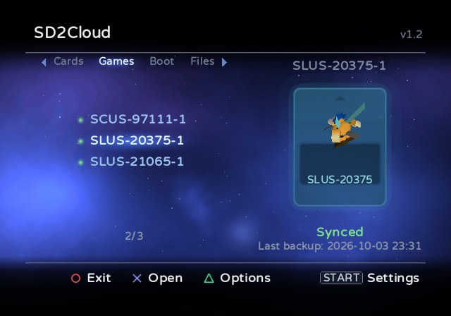
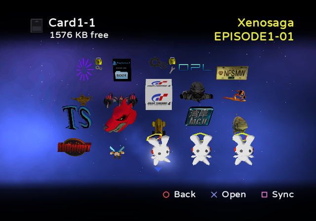
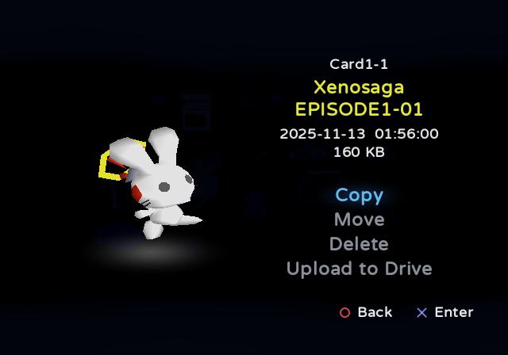
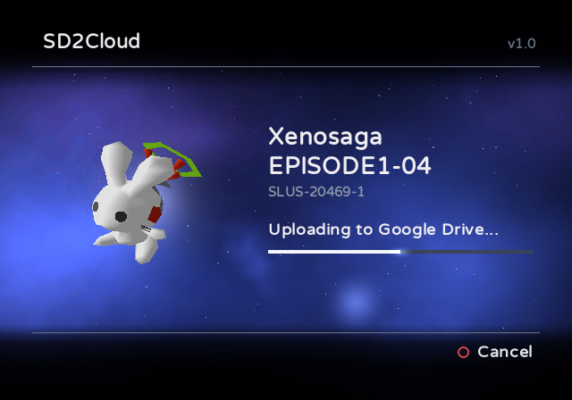
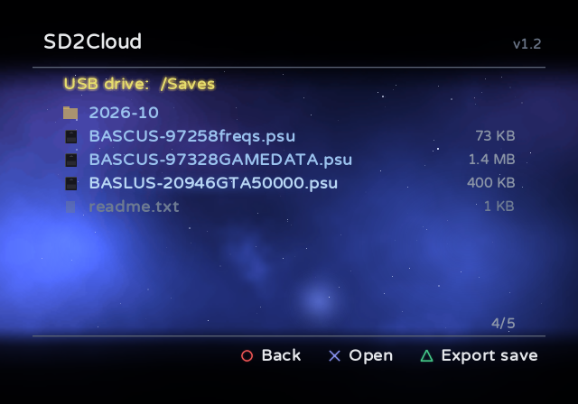
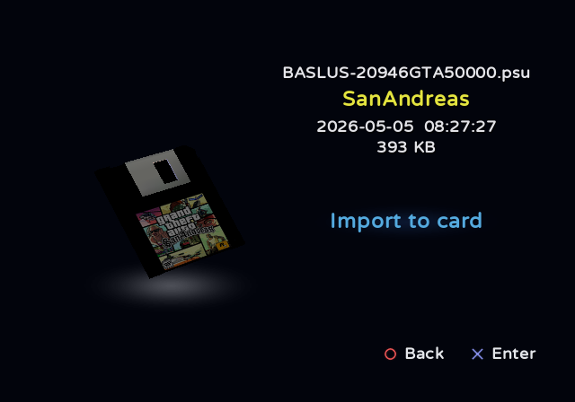

# SD2Cloud

**Manage and back up your sd2psx memory cards, right on your PS2.**

> [!WARNING]
> SD2Cloud is at an early stage and has not been widely tested yet. Before copying, moving, deleting, importing or
> restoring saved data with it, back up your memory cards: copy the `MemoryCards` folder of the microSD to a PC.

SD2Cloud runs on the PS2 itself and works with the memory cards stored on the microSD of sd2psx-family devices
running the [sd2psXtd](https://github.com/sd2psXtd/firmware) firmware (sd2psx, PSXMemCard, PSXMemCard Gen2,
PicoMemcard+/Zero). No PC is required.

[Português](README.pt-BR.md)

  
  

  
  

  
  

## Features

**Cloud sync**
- Syncs your memory cards with your Google Drive, on demand or automatically every time you exit a game with IGR.
  Only the cards that changed are uploaded.
- Keeps a history of backups for each card (10 by default) and restores any of them, verified before and after
  writing. A changed card is synced before it is restored, so nothing is lost.
- Sends each card as the sd2psx's own `.mcd` or, if you choose so in the settings, as a `.ps2`, the format PCSX2
  uses: take it out of the backup's zip and it is ready for the emulator. Both can be restored.
- Signs in once with a code or a QR code. SD2Cloud can only access the files it creates in your Drive.

**Memory card manager**
- Shows the saved data of each card the way the PS2 browser does, with animated 3D icons.
- Copies, moves and deletes saved data between the cards on the microSD (the destination's free space is shown),
  and uploads a single item to Google Drive as a `.psu` file.
- Organizes the cards in tabs: numbered cards, game (Game ID) cards and boot cards.
- Copies a whole card, as a `.mcd` or a `.ps2` file, to a folder of the microSD or of a USB drive (in the card's
  options).
- Imports and exports `.psu` files: the **Files** tab browses the folders of the microSD and of a USB drive (FAT32
  or exFAT), installs a `.psu` into any card and saves any item of a card as a `.psu`. What is written is read back
  and compared.

**Also**
- Asks for confirmation before anything that uploads, writes or deletes data.
- Settings on the console (START), saved to `sd2cloud.ini`, which can also be edited on a PC.
- Returns to OPL on the microSD, a memory card, USB, MX4SIO or the internal HDD (exFAT or APA), loading only the
  drivers of that device.
- Updates itself from this repository's releases, verified against GitHub's SHA-256.
- Interface inspired by the PlayStation BB Navigator.
- English and Portuguese.

## Requirements

- An sd2psx-family device with the sd2psXtd firmware (MMCE support).
- A way to start SD2Cloud: the Apps tab of OPL, wLaunchELF or any other launcher that can run an ELF. An OPL with
  MMCE support is recommended, such as [RiptOPL](https://github.com/NathanNeurotic/Open-PS2-Loader). Without it, OPL does not list the apps on the sd2psx
  microSD and has no **IGR Bootcard Slot(s)** option: with Game ID cards, the sd2psx stays on the game's card when
  you exit with IGR, the PS2 goes back to the browser instead of opening SD2Cloud, and the automatic sync does not
  happen.
- For the automatic sync after a game: OPL, which starts SD2Cloud through its IGR.
- For the cloud features: a PS2 with a network adapter (built into Slim models), connected to your router with a
  cable, and a Google account.

## Installation

1. Download `SD2Cloud-vX.Y.zip` from the [latest release](../../releases/latest).
2. Extract it to the root of the sd2psx microSD. It adds `APPS/SD2Cloud` (the application) and
   `SD2Cloud/sd2cloud.ini` (the settings, explained in `sd2cloud.example.ini` next to it).
3. Open SD2Cloud: from the Apps tab of OPL, or by running `APPS/SD2Cloud/SD2CLOUD.ELF` with any launcher
   (wLaunchELF, for example). The folder does not have to stay in `APPS`.
4. Connect your Google account when asked (or later, in Settings): visit google.com/device on your phone or
   computer, or scan the QR code, and enter the code shown on the TV.
5. SD2Cloud then offers to turn on automatic sync and to sync all your cards.

If your OPL does not list the apps on the sd2psx microSD (a build without MMCE support), also copy the
`APPS/SD2Cloud` folder to the `APPS` folder of your USB drive or MX4SIO card and open SD2Cloud from there. It hands
over to the copy on the microSD, where the settings, the IGR helper and the updates are kept.

The [README.txt](package/README.txt) included in the release explains every screen in detail.

## Controls

| Screen | Buttons |
|---|---|
| Main screen | Up/Down: card · Left/Right or L1/R1: tab · X: open the card · TRIANGLE: card options (sync now, restore a backup, copy to a device) · START: settings · O: exit |
| Inside a card | X: open a save · SQUARE: sync this card · O: back |
| A save's page | Copy · Move · Delete · Upload to Drive |
| Files tab | X: open the device, a folder or a `.psu` file (then **Import to card**) · TRIANGLE: export a save of a card to the folder shown (also reached from **Copy** on a save's page, whose destinations include this tab) · Left/Right: a page up or down · O: back |
| During an upload | O: cancel |

## Automatic sync after a game (IGR)

1. In SD2Cloud, open Settings (START) and select **IGR helper** (it is also offered right after you sign in).
   SD2Cloud shows how much space the helper takes (about 95 KB) and asks before writing it to
   `mc0:/BOOT/SD2CLOUD-IGR.ELF` on the memory card in use; with Autoboot, install it while the BootCard is in
   use.
2. In OPL Settings, set **IGR Path** to `mc?:/BOOT/SD2CLOUD-IGR.ELF`.
3. In OPL, also turn on **IGR Bootcard Slot(s)** (MMCE page), set to the sd2psx slot or BOTH: when you exit a game,
   OPL switches back to the BootCard, where the helper is installed.

From then on, exiting a game with IGR starts SD2Cloud, which uploads the cards that changed and returns to OPL.
The same option reinstalls or uninstalls the helper. SD2Cloud can be kept in any folder of the sd2psx microSD:
when it is not in `APPS/SD2Cloud`, it records where it is in `sd2cloud.ini`, and the helper starts it from there.

To pause the sync and keep everything installed, set **Automatic sync** to Off in Settings (START): IGR then goes
straight to the program opened after it, without starting SD2Cloud. The same happens while no Google account is
connected.

**Without installing anything (USB drive).** OPL's IGR can also start a program from a USB drive. If the
`APPS/SD2Cloud` folder is on one, formatted as FAT32, skip step 1 and set **IGR Path** to
`mass:/APPS/SD2Cloud/SD2CLOUD-IGR.ELF`: nothing is written to the memory card. For this, OPL loads the USB drivers
`USBD.IRX` and `USBHDFSD.IRX` from `mc?:/SYS-CONF`, where FMCB installs them. The helper on the memory card is only
needed when SD2Cloud is on the sd2psx microSD alone, or on a device OPL's IGR cannot read (MX4SIO, HDD).
If your OPL is not on the sd2psx microSD, set its path in the `[igr]` section of `sd2cloud.ini`, starting with
the device: `mc?:/` (memory card), `mass:/` (USB), `mx4sio:/`, `ata:/` (internal HDD, exFAT) or
`hdd0:PARTITION:pfs:/` (internal HDD, APA), for example `hdd0:__common:pfs:/APPS/OPL/OPNPS2LD.ELF`.

## Privacy

Your memory cards go from the PS2 straight to your own Google Drive; no other server is involved and nothing is
collected. SD2Cloud uses the `drive.file` scope, so it can only see the files it creates. Access can be revoked at
any time at [myaccount.google.com/permissions](https://myaccount.google.com/permissions). Besides Google, SD2Cloud
only contacts GitHub, and only when you select Check for updates in the settings.

## Building

SD2Cloud is written in C with the [ps2dev](https://github.com/ps2dev) toolchain (ps2sdk, ps2sdk-ports, gsKit).

1. `tools/build_ports.sh` builds wolfSSL and curl with 4096-bit RSA support into `ports4096/` (Google's HTTPS needs it).
2. `tools/build_mmceman.sh` builds mmceman, the sd2psx driver, into `third_party/mmceman/` (the one that comes with
   the SDK can hang the sd2psx during long transfers).
3. Create an OAuth client of type "TVs and Limited Input devices" in the Google Cloud Console, with the Drive API
   enabled, and generate `src/credentials.h`: `python tools/make_credentials.py client_secret.json src/credentials.h`.
4. `make` builds `dist/SD2CLOUD.ELF` and the IGR helper (`igr/`); `make DEBUG=1` builds a debug version for PCSX2.
5. `python tools/make_release.py` packages the release in `dist/`, with the texts in `package/`.

## Reporting bugs and contributing

Found a problem? Open an [issue](../../issues/new/choose) and fill in the form: the SD2Cloud version, the console,
the sd2psx device and its firmware, how SD2Cloud was started and the steps that lead to the problem. Ideas and
suggestions are welcome there too. Issues can be written in English or in Portuguese.

Pull requests are welcome. [CONTRIBUTING.md](CONTRIBUTING.md) explains how to build, the conventions of the code
and what to check before sending one.

## Credits and license

SD2Cloud is developed by MrRexD and distributed under the [GNU General Public License v3](LICENSE).

The design is inspired by the PlayStation BB Navigator. SD2Cloud uses the
[Varela Round](https://github.com/alefalefalef/Varela-Round-Hebrew) font (SIL Open Font License) and the libraries
listed in [THIRD-PARTY-NOTICES.txt](package/THIRD-PARTY-NOTICES.txt).

PlayStation is a registered trademark of Sony Interactive Entertainment. SD2Cloud is not affiliated with or
endorsed by Sony or Google.
