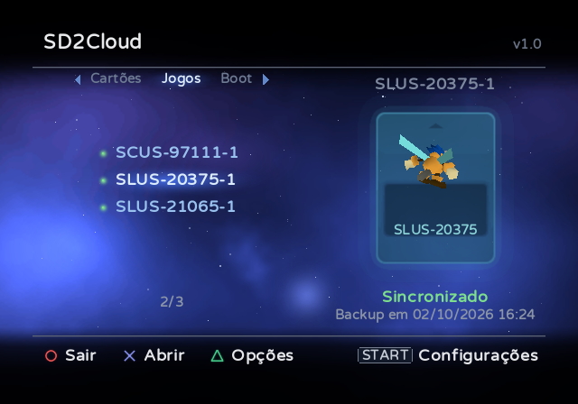
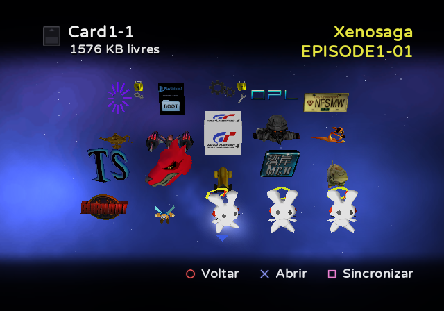
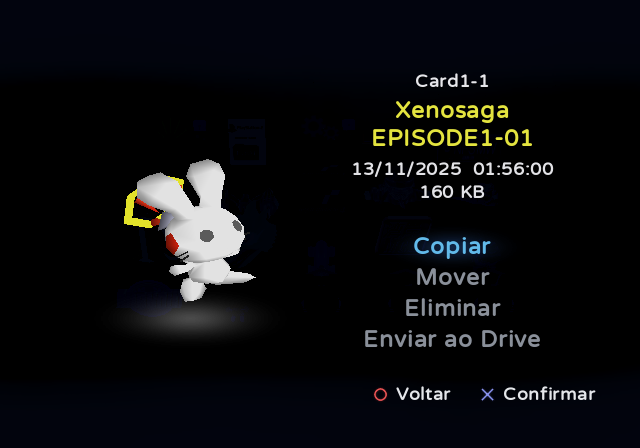
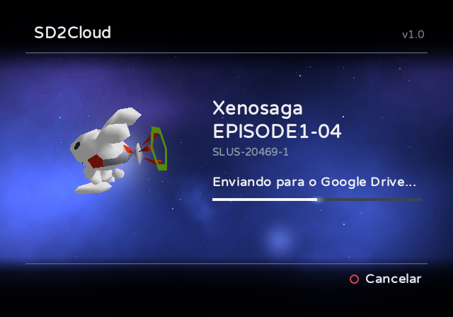
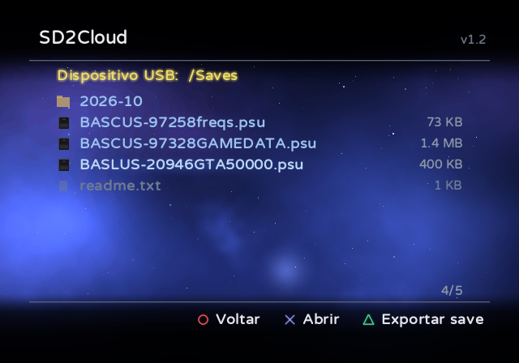
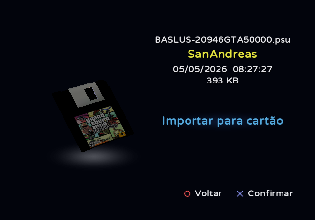

# SD2Cloud

**Gerencie e proteja os cartões de memória do seu sd2psx, direto no PS2.**

> [!WARNING]
> O SD2Cloud está em estágio inicial e ainda foi pouco testado. Antes de copiar, mover, apagar, importar ou
> restaurar dados salvos com ele, faça um backup dos seus cartões de memória: copie a pasta `MemoryCards` do
> microSD para um PC.

O SD2Cloud roda no próprio PS2 e trabalha com os cartões de memória guardados no microSD dos dispositivos da
família sd2psx com o firmware [sd2psXtd](https://github.com/sd2psXtd/firmware) (sd2psx, PSXMemCard, PSXMemCard
Gen2, PicoMemcard+/Zero), sem necessidade de um PC. O MemCard PRO2 também é reconhecido, de forma experimental: o
SD2Cloud ainda não foi testado em um.

[English](README.md)

  
  

  
  

  
  

## Recursos

**Sincronização com a nuvem**
- Sincroniza os cartões de memória com o seu Google Drive, quando você quiser ou automaticamente sempre que você
  sai de um jogo pelo IGR. Somente os cartões alterados são enviados.
- Mantém um histórico de backups de cada cartão (10 por padrão) e restaura qualquer um deles, com verificação
  antes e depois da gravação. Um cartão alterado é sincronizado antes da restauração, para que nada se perca.
- Envia cada cartão como `.mcd`, o formato do próprio sd2psx, ou, se você escolher nas configurações, como `.ps2`,
  o formato usado pelo PCSX2: é só tirar o arquivo do zip do backup e ele está pronto para o emulador. Os dois
  podem ser restaurados.
- Conecta a conta uma única vez, com um código ou um QR code. O SD2Cloud tem acesso apenas aos arquivos que ele
  mesmo cria no seu Drive.

**Gerenciador de cartões de memória**
- Exibe os dados salvos de cada cartão como o navegador do PS2, com os ícones 3D animados.
- Copia, move e elimina dados salvos entre os cartões do microSD (o espaço livre do destino é exibido), e envia
  um item avulso ao Google Drive como arquivo `.psu`.
- Exibe os dados salvos de todos os cartões de jogo em uma só tela (**Todos os saves**, na aba Jogos), como se fossem
  um único cartão.
- Organiza os cartões em abas: cartões numerados, cartões de jogos (Game ID), em pastas com o nome de cada jogo,
  e cartões de boot.
- Marca o cartão que está em uso no sd2psx e pode fazê-lo assumir outro (nas opções do cartão). Para alterar o
  cartão em uso, ele pergunta, troca o sd2psx para outro cartão e volta.
- Copia um cartão inteiro, como um `.zip` com o `.mcd` ou o `.ps2` dentro, para uma pasta do microSD ou de um
  pendrive USB (nas opções do cartão).
- Abre arquivos de cartão de memória na aba **Arquivos** (`.mcd`, o `.mc2` do MemCard PRO2, o `.ps2` do PCSX2, os
  cartões virtuais do OPL (`.bin`) ou esse `.zip`), copia dados salvos de dentro deles e os instala no microSD: como um cartão novo (numerado, de um
  jogo ou mais um canal do BootCard) ou no lugar de um existente.
- Importa e exporta arquivos `.psu`: a aba **Arquivos** navega pelas pastas do microSD e de um pendrive USB (FAT32
  ou exFAT), instala um `.psu` em qualquer cartão e grava qualquer item de um cartão como `.psu`. O que é gravado
  é lido de volta e comparado.

**E também**
- Pede confirmação antes de qualquer operação que envia, grava ou elimina dados.
- Configurações no próprio console (START), gravadas no `sd2cloud.ini`, que também pode ser editado no PC.
- Retorna ao OPL no microSD, num cartão de memória, no USB, no MX4SIO ou no HD interno (exFAT ou APA), carregando
  somente os drivers desse dispositivo.
- Inicia outros programas: qualquer ELF escolhido nas pastas do microSD ou de um pendrive USB (X sobre ele em
  **Arquivos**, ou "Executar um ELF..." ao sair) e um aplicativo guardado em um cartão de memória no formato do Save
  Application System ("Iniciar aplicativo" na página dele; o sd2psx é trocado para esse cartão).
- Atualiza-se pelas releases deste repositório, com verificação pelo SHA-256 publicado no GitHub. Dois canais,
  escolhidos nas configurações: **Estável**, as versões lançadas, e **Beta**, uma compilação feita automaticamente a
  cada alteração, antes dos testes que uma versão recebe (a [pre-release beta](../../releases/tag/beta)).
- Visual inspirado no PlayStation BB Navigator.
- Em português e em inglês.

## Requisitos

- Dispositivo da família sd2psx com o firmware sd2psXtd (suporte a MMCE). Em um MemCard PRO2 (experimental), o
  SD2Cloud lê e grava os cartões `.mc2` dele em `/PS2`. A troca de cartão pelo app ("Inserir este cartão") é um
  preview nele, e o SD2Cloud nunca troca sozinho: para alterar o cartão em uso, selecione outro antes.
- Uma forma de abrir o SD2Cloud: a aba Apps do OPL, o wLaunchELF ou qualquer outro programa que abra um ELF.
  Recomenda-se um OPL com suporte a MMCE, como o [RiptOPL](https://github.com/NathanNeurotic/Open-PS2-Loader). Sem esse suporte, o OPL não lista os apps do
  microSD do sd2psx e não tem a opção **Slot(s) de Bootcard IGR**: com cartões de Game ID, o sd2psx continua no
  cartão do jogo ao sair pelo IGR, o PS2 volta para o navegador em vez de abrir o SD2Cloud, e a sincronização
  automática não acontece.
- Para a sincronização automática após o jogo: o OPL, que abre o SD2Cloud pelo IGR.
- Para os recursos de nuvem: PS2 com adaptador de rede (integrado nos modelos Slim) conectado ao roteador por
  cabo, e uma conta do Google.

## Instalação

1. Baixe o `SD2Cloud-vX.Y.zip` da [release mais recente](../../releases/latest).
2. Extraia na raiz do microSD do sd2psx. Serão criadas as pastas `APPS/SD2Cloud` (o aplicativo) e `SD2Cloud`,
   com o `sd2cloud.ini` (as configurações, explicadas no `sd2cloud.example.ini` ao lado dele).
3. Abra o SD2Cloud: pela aba Apps do OPL, ou executando `APPS/SD2Cloud/SD2CLOUD.ELF` em qualquer programa que abra
   um ELF (o wLaunchELF, por exemplo). A pasta não precisa ficar em `APPS`.
4. Conecte a sua conta do Google quando ele perguntar (ou depois, nas Configurações): acesse google.com/device no
   celular ou no computador, ou use o QR code, e digite o código exibido na TV.
5. Em seguida, o SD2Cloud oferece a sincronização automática e a sincronização de todos os cartões.

Se o seu OPL não lista os apps do microSD do sd2psx (versão sem suporte a MMCE), copie também a pasta
`APPS/SD2Cloud` para a pasta `APPS` do pendrive USB ou do cartão do MX4SIO e abra o SD2Cloud por lá. Ele passa a
vez para a cópia do microSD, onde ficam as configurações, o assistente de IGR e as atualizações.

**Save Application System (SAS).** Cada release traz também o `APP_SD2CLOUD.psu`: o mesmo programa em uma única
pasta `APP_SD2CLOUD`, com ícone 3D próprio para o browser do PS2. Na pasta `APPS` do microSD
(`APPS/APP_SD2CLOUD`) ele funciona exatamente como descrito aqui. Em um cartão de memória, junto dos dados
salvos, ele fica por lá: atualiza-se nessa mesma pasta (o cartão precisa ter espaço para a versão nova ao lado da
atual) e, para a sincronização automática, o "Definir saída do IGR" do OPL é
`mc?:/APP_SD2CLOUD/SD2CLOUD-IGR.ELF`, sem instalar nada. Se também houver um SD2Cloud no microSD, é ele que
assume.

O [LEIA-ME.txt](package/LEIA-ME.txt) incluído na release explica cada tela em detalhes.

## Controles

| Tela | Botões |
|---|---|
| Tela principal | Cima/Baixo: cartão · Esquerda/Direita ou L1/R1: aba · X: abrir o cartão · TRIÂNGULO: opções do cartão (sincronizar agora, restaurar backup, copiar para dispositivo, inserir no sd2psx) · START: configurações · O: sair |
| Dentro de um cartão | X: abrir um item · QUADRADO: sincronizar este cartão · O: voltar |
| Página de um item | Copiar · Mover · Eliminar · Enviar ao Drive |
| Aba Arquivos | X: abrir o dispositivo, uma pasta, um arquivo `.psu` ou um arquivo de cartão de memória · QUADRADO: instalar o `.psu` selecionado em um cartão, ou o arquivo de cartão selecionado no microSD · Esquerda/Direita: uma página acima ou abaixo · O: voltar. Para exportar um item, use o **Copiar** da página dele: os destinos incluem esta aba, e TRIÂNGULO grava o `.psu` na pasta exibida |
| Durante um envio | O: cancelar |

## Sincronização automática após o jogo (IGR)

1. No SD2Cloud, abra as Configurações (START) e selecione **Assistente de IGR** (ele também é oferecido logo
   depois de você conectar a conta). O SD2Cloud informa o espaço que o assistente ocupa (cerca de 95 KB) e pede
   confirmação antes de gravá-lo em `mc0:/BOOT/SD2CLOUD-IGR.ELF`, no cartão de memória em uso; com o Autoboot,
   faça a instalação com o BootCard em uso.
2. Nas configurações do OPL, em **Definir saída do IGR**, informe `mc?:/BOOT/SD2CLOUD-IGR.ELF`.
3. No OPL, ative também **Slot(s) de Bootcard IGR** (página MMCE), no slot do sd2psx ou em BOTH: ao sair do jogo,
   o OPL volta para o BootCard, onde o assistente está instalado.

A partir daí, ao sair de um jogo pelo IGR, o SD2Cloud envia os cartões alterados e retorna ao OPL. A mesma opção
reinstala ou desinstala o assistente. O SD2Cloud pode ficar em qualquer pasta do microSD do sd2psx: quando não
está em `APPS/SD2Cloud`, ele registra onde está no `sd2cloud.ini`, e o assistente o inicia a partir dali.

Para pausar a sincronização sem desinstalar nada, deixe **Sincronização automática** como Desativada em
Configurações (START): o IGR passa a ir direto para o programa aberto depois dele, sem iniciar o SD2Cloud. O mesmo
acontece enquanto não há conta do Google conectada.

**Sem instalar nada (pendrive USB).** O IGR do OPL também abre programas de um pendrive USB. Se a pasta
`APPS/SD2Cloud` estiver em um, formatado em FAT32, pule o passo 1 e informe `mass:/APPS/SD2Cloud/SD2CLOUD-IGR.ELF`
em **Definir saída do IGR**: nada é gravado no cartão de memória. Para isso, o OPL carrega os drivers USB
`USBD.IRX` e `USBHDFSD.IRX` de `mc?:/SYS-CONF`, onde o FMCB os instala. O assistente no cartão de memória só é
necessário quando o SD2Cloud está apenas no microSD do sd2psx ou em um dispositivo que o IGR do OPL não lê
(MX4SIO, HD).

Se o seu OPL
não estiver no microSD do sd2psx, informe o caminho dele na seção `[igr]` do `sd2cloud.ini`, começando pelo
dispositivo: `mc?:/` (cartão de memória), `mass:/` (USB), `mx4sio:/`, `ata:/` (HD interno exFAT) ou
`hdd0:PARTIÇÃO:pfs:/` (HD interno APA), por exemplo `hdd0:__common:pfs:/APPS/OPL/OPNPS2LD.ELF`.

## Privacidade

Os seus cartões de memória vão do PS2 direto para o seu Google Drive; nenhum outro servidor é usado e nenhuma
informação é coletada. O SD2Cloud usa o escopo `drive.file`, então só enxerga os arquivos que ele mesmo cria. O
acesso pode ser revogado a qualquer momento em
[myaccount.google.com/permissions](https://myaccount.google.com/permissions). Além do Google, o SD2Cloud só se
comunica com o GitHub, e somente quando você seleciona Verificar atualizações nas configurações.

## Compilação

O SD2Cloud é escrito em C com o toolchain do [ps2dev](https://github.com/ps2dev) (ps2sdk, ps2sdk-ports, gsKit).

1. `tools/build_ports.sh` compila o wolfSSL e o curl com suporte a RSA de 4096 bits em `ports4096/` (o HTTPS do
   Google exige isso).
2. `tools/build_mmceman.sh` compila o mmceman, o driver do sd2psx, em `third_party/mmceman/` (o que vem com o SDK
   pode travar o sd2psx em transferências longas).
3. Crie um cliente OAuth do tipo "TVs e dispositivos de entrada limitada" no Google Cloud Console, com a Drive API
   ativada, e gere o `src/credentials.h`: `python tools/make_credentials.py client_secret.json src/credentials.h`.
4. `make` gera o `dist/SD2CLOUD.ELF` e o assistente de IGR (`igr/`); `make DEBUG=1` gera uma versão de debug para o
   PCSX2.
5. `python tools/make_release.py` monta a release em `dist/`, com os textos de `package/`.

## Relatar bugs e colaborar

Encontrou um problema? Abra uma [issue](../../issues/new/choose) e preencha o formulário: a versão do SD2Cloud, o
console, o dispositivo sd2psx e o firmware dele, como o SD2Cloud foi aberto e os passos que levam ao problema.
Ideias e sugestões também são bem-vindas por lá. As issues podem ser escritas em português ou em inglês.

Pull requests são bem-vindos. O [CONTRIBUTING.md](CONTRIBUTING.md) explica como compilar, as convenções do código e
o que conferir antes de enviar um.

## Créditos e licença

O SD2Cloud é desenvolvido por MrRexD e distribuído sob a [GNU General Public License v3](LICENSE).

O visual é inspirado no PlayStation BB Navigator. O SD2Cloud usa a fonte
[Varela Round](https://github.com/alefalefalef/Varela-Round-Hebrew) (SIL Open Font License) e as
bibliotecas listadas no [THIRD-PARTY-NOTICES.txt](package/THIRD-PARTY-NOTICES.txt).

PlayStation é marca registrada da Sony Interactive Entertainment. O SD2Cloud não é afiliado nem endossado pela
Sony ou pelo Google.
